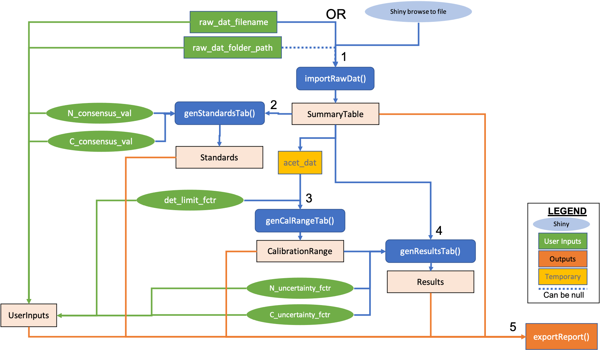

# msucostech

Montana State University Environmental Laboratory Shiny application for
creating automated data reports from raw Costech ECS 4010 data.

The application can be found at **URL**. Code can be found at
<https://github.com/paulhegedus/msucostech>. An example of the workflow
in traditional R formatting can be found in the ‘dev’ folder within the
repository. These are updated as of 2021/01/22.

### Inputs

The application takes a .xlsx or .xls with the only requirement of
having a sheet named ‘Summary Table’ within it. This table is assumed
exported from the Costech ECS 4010 at MSU in a specified data format,
however it is up to the use to be specifiying their raw data or another
table that includes a ‘Summary Table’ tab. If the ‘Summary Table’ sheet
of the provided Excel sheet is not formatted as exported (i.e. modified
in any way) from the MSU EAL Costech, there is no guarantee that this
application will work correctly. However, a good verification of the
application is if the user is providing an Excel spreadsheet that is a
product of previous MSU EAL data reports (as of 2021/01/22) which
include the unmanipulated raw data in a ‘Summary Table’ sheet, from
which the applications results can be compared to. When the user browses
to their Excel spreadsheet with a ‘Summary Table’, only the ‘Summary
Table’ sheet is imported.

The user also must provide inputs for the following parameters to
execute the workflow. If the user neglects to set any values, the
defaults will be used; + **Nitrogen Detection Limit Factor:** Factor to
divide the low calibration range for nitrogen by to estimate ‘below
detection limit’. Default is 2. + **Carbon Detection Limit Factor:**
Factor to divide the low calibration range for carbon by to estimate
‘below detection limit’. Default is 10. + **Total Nitrogen Uncertainty
Factor:** Estimate for the uncertainty of total nitrogen %. Provide as
decimal, default is 0.1. + **Total Carbon Uncertainty Factor:** Estimate
for the uncertainty of total Carbon %. Provide as decimal, default is
0.05. + **Nitrogen Consensus Factor:** Consensus value for nitrogen
derived from prior Costech standards, divided from the measured
‘Standards’ to evaluate new measurements with prior Costech data.
Default is 0.14. + **Carbon Consensus Factor:** Consensus value for
carbon derived from prior Costech standards, divided from the measured
‘Standards’ to evaluate new measurements with prior Costech data.
Default is 1.67.

The output Excel spreadsheet has a sheet called ‘User Inputs’ that
contains the entries for the parameters the user provided. If the user
does not provide one of the inputs, the ‘User Inputs’ table will display
the default value used in the calculations.

### Workflow

The following image shows the workflow for creating the automated report
from the Costech. The workflow shows the inputs used in the code and
Shiny application, the functions used in the application code, and the
tables that compose the exported report.

Workflow for the MSU EAL Costech automated data report. Green shapes in
the image below characterize inputs, with ovals representing inputs that
are also used in the Shiny application. Functions used in the
application are shown in blue and temporary data is represented by
yellow shapes. Sheets in the exported Excel report are shown in coral.
All of the inputs are included in the ‘User Inputs’ table of the output.

The following shows the sequence of the workflow while the image
visualizes the connection of user inputs, processes, and outputs. *(1):*
The workflow begins by importing raw data. This file is browsed to in
the Shiny application, and the data path is used to import the ‘Summary
Table’ spreadsheet of the Excel spreadsheet (.xlsx or .xls). When the
user elects to create the data report, the raw data is immediately set
aside for export. *(2):* The ‘Standards’ table is created by subsetting
using the raw data that includes Standard D samples. *(3):* Next, the
‘Calibration Range’ table is generated from calculations derived from
the calibration samples and the and the user specified detection limit
factor for each element. The ‘Standards’ table and consensus factors for
nitrogen and carbon are used to calculate the average working standard
and consensus value for each element, added to the ‘Calibration Range’
table. *(4):* After the ‘Calibration Range’ table is generated, the
‘Results’ table is created using the calibration values and the user
specified uncertainty factors. *(5):* Finally, the data is packaged into
an Excel file and exported. For more detail, see below or peruse the
code.

The scripts for the application and the code for creating the report are
contained in the ‘msucostech\_report\_app’ folder of this repository.
The ‘msucostech\_report\_app.R’ contains the application deployment and
‘msucostech\_report\_fxns.R’ contains the supporting code. The
following sections describe the arguments, process, and output for each
function;

  - **genUserInputsTab():** Arguments are the parameters provided by the
    user for the report generation. These include all the parameters
    defined in the Inputs section above. Argument names are
    ‘raw\_dat\_filename’, ‘raw\_dat\_folder\_path’,
    ‘det\_limit\_fctr’, ‘N\_uncertainty\_fctr’,
    ‘C\_uncertainty\_fctr’, ‘N\_consensus\_fctr’, and
    ‘C\_consensus\_fctr’. If the user did not provide specifications
    for a parameter, the default values are used. This function creates
    a data frame with a column called ‘Input’ with the full input name,
    a column called ‘Abbreviation’ with the input abbreviation used in
    the code, and a column called ‘Entry’ with either the user specified
    value or the default value. This table is exported as the ‘User
    Inputs’ sheet in the Excel report.
  - **importRawDat():** Arguments are ‘raw\_dat\_filename’ character,
    which is the file name for the raw data from the Costech ECS 4010,
    and an optional ‘raw\_dat\_folder\_path’ character which is a path
    to folder where the ‘.xlsx’ raw file is stored (this is only really
    used in the script form, but still optional). This function imports
    the ‘Summary Table’ sheet in the provided Excel file path, sets the
    column names via a predetermined MSU EAL Costech format to remove
    merged cells, and returns the raw data frame. This requires the
    Costech outputs to remain standard. This data frame is exported in
    the ‘Summary Table’ sheet of the report.
  - **genStandardsTab():** Arguments for this function are the
    ‘SummaryTable’ data frame which is the raw Costech data, a
    character vector of identifiers potentially in the ‘SampleID’s for
    Standard D samples called ’std\_d\_identifiers’. This is a baked in
    set of identifiers that include ‘Std\_D’, ‘Standard’, and ‘StdD’.
    This function subsets Standard D samples from the raw data.
    Currently this process is performed via pattern matching the
    expected codes used for Standard D samples using the
    ‘std\_d\_identifiers’ matched in the ‘SampleID’ column. This is
    not case sensitive and requires a mild standardization of SampleIDs
    to be identifiable. The returned data frame contains all of the
    columns in the raw data. Thus, the ‘Standards’ table exported in the
    report is identical to the ‘Summary Table’ but should only have
    Standard D samples.
  - **genCalRangeTab():** The arguments for this function are the
    ‘SummaryTable’ data frame, which is the raw Costech data, the
    ‘Standards’ table or a data frame with only Standard D samples
    subsetted from raw Costech data, a character vector of identifiers
    possibly in the ‘SampleID’s column for calibration samples called
    ’cal\_identifiers’. This is a baked in set of identifiers that
    include ‘Acetanilide’, ‘Acet’, ‘Acetan’, ‘Acetanalide’, ‘analide’,
    ‘atropine’, ‘atro’ for common calibration standards such as
    Acetanilide or Atropine. The third and fourth arguments are the user
    specified detection limit factor for each element
    (‘N\_det\_limit\_fctr’ and ‘C\_det\_limit\_fctr’), and the final
    two arguments are the nitrogen and carbon consensus factors,
    ‘N\_consensus\_fctr’ and ‘C\_consensus\_fctr’, which are used to
    calculate the consensus value of the standard samples for each
    element.

This function subsets calibration samples from the raw data. Currently
this process is performed via pattern matching expected codes used for
calibration samples using the ‘cal\_identifiers’ matched in the
‘SampleID’ column. This is not case sensitive and requires a mild
standardization of ‘SampleID’s to be identifiable. An empty ’Calibration
Range’ table is generated with a column labeled ‘CalibrationRange’ with
‘N’ and ‘C’ to deliminate nitrogen and carbon limits and filled in
with the following calculations. The low and high calibration ranges
(‘LowCalibration’ and ‘HighCalibration’ columns) for each element are
derived by multiplying the minimum and maximum calibration sample
amounts (‘Sample Amount’ in the ‘Summary Table’) by 0.1036 for nitrogen
and 0.7109 for carbon. These values are baked into the application and
used because the calibration standard weights are measured. This means
there is uncertainty in the measured weights by the Costech, and so the
weight of the samples measured prior to Costech analysis are used
multiplied by 10.36% and 71.09% for nitrogen and carbon, respectively,
as a more accurate measure of the weight of nitrogen and carbon in the
calibration samples. The ‘DetectionLimit’ column is calculated by
dividing the low calibration range by the user specified detection limit
factor for each element (‘N\_det\_limit\_fctr’ or ‘C\_det\_limit\_fctr’,
respectively). This may be a temporary process until a data-driven
approach is developed.

The mean and standard deviation are calculated from the weight
percentages in the ‘Standards’ table for nitrogen and carbon, and are
placed in the appropriate rows of the ‘Calibration Range’ table in
columns labeled ‘StandardMean’ and ‘StandardSD’, respectively. The
coefficient of variation for both elements are then calculated as the
standard deviation divided by the mean and added as a column labeled
‘StandardCV’. A consensus value is then derived in the
‘ConsensusValue’ column by dividing the mean weight percent of the
Standard D samples for each element (‘StandardMean’) by the user
specified consensus factor for each element (‘N\_consensus\_fctr’,
‘C\_consensus\_fctr’). After the ‘Calibration Range’ table has been
completed, it is returned to the user. This is exported in the Excel
spreadsheet report in the ‘Calibration Range’ sheet. +
**genResultsTab():** The arguments for this function are the
‘SummaryTable’ data frame which is the raw Costech data, the
‘Calibration Range’ data frame created from the genCalRangeTab()
function as ‘CalibrationRange’, the ‘std\_d\_identifiers’ and
‘cal\_identifiers’ character vectors specified as arguments in the
functions above, and the uncertainty factors for nitrogen and carbon
(‘N\_uncertainty\_fctr’ and ‘C\_uncertainty\_fctr’, respectively).

This function uses the identifiers for Standard D and calibration
samples to take all rows that aren’t these or a bypass, identified by
‘Bypass’ or ‘By pass’ in the SampleID. The ‘SampleID’, weight
(‘x\_Weight\_mg’, where ‘x’ is ‘C’ or ‘N’) and weight percents
(‘x\_Weight\_pct’, where ‘x’ is ‘C’ or ‘N’) are the columns taken from
the raw data during the subsetting process. The weight percent columns
are renamed to ‘%TN’ and ‘%TC’, respectively for each element. The
nitrogen and carbon percent uncertainty are calculated and added to the
table by multiplying the weight percent by the nitrogen or carbon
uncertainty factor that was specified by the user. These are included as
columns named ‘%TN uncertainty’ and ‘%TC uncertainty’.

Using the weights in mg for each element, the flags (‘%TN flag’ and ‘%TC
flag’) are derived by determining if the weight falls; first below the
detection limit, and then within the bounds of the quantifiable limits.
Observations are labeled ‘bdl’ if the measurement falls below the
detection limit, ‘bql’ if the measurement falls below the lower
quantifiable limit, ‘aql’ if the measurement exceeds the upper
quantifiable limit, or ‘ok’ if it falls within the quantifiable limits.
The detection and quantifiable detection limits for each element are
taken from the ‘CalibrationRange’ table.

The weight columns are removed from the ‘Results’ table, the columns are
organized by element, and the ‘Results’ table is returned to the user.
This table is exported in the ‘Results’ sheet of the Excel report. +
**.exportReport():** This function takes a list of outputs, labeled
‘Results’, ‘CalibrationRange’, ‘Standards’, ‘SummaryTable’, and
‘UserInputs’ from the functions above, in any order. This function
then puts them into an Excel spreasheet that is exported to the user’s
file system folder with sheets labeled as ‘Results’, ‘Calibration
Range’, ‘Standards’, ‘Summary Table’, and ‘User Inputs’. The exported
filename is a concatenation of the raw filename with ‘*REPORT*’ plus the
date and time the report was generated.

### Outputs

When raw data and inputs are provided, the user must select the ‘Create
Report’ button. The output data report will be automatically downloaded
upon completion. The output Excel sheet has tabs for ‘Results’,
‘Calibration Range’, ‘Standards’, ‘Summary Table’, and ‘User Inputs’.
The ‘Results’ table contains the total nitrogen and carbon weight
percentages, uncertainties, and a flag for whether the observation falls
within the detectable limits. The ‘Calibration Range’ table contains the
low and high calibration range and the detection limit for nitrogen and
carbon, as well as the mean, standard deviation, coefficient of
variation, and consensus value of the standard samples for each element.
The ‘Standards’ table includes the Standard D samples from the raw data.
The ‘Summary Table’ contains the unmodified raw data and the ‘User
Inputs’ table contains the parameters used in the calculations.
